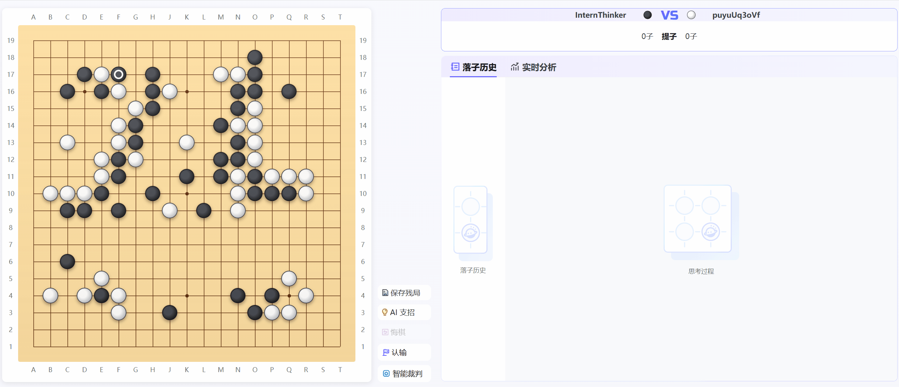

# **Mixing Expert Knowledge: Bring Human Thoughts Back to The Game of Go**

Repo for *Mixing Expert Knowledge: Bring Human Thoughts Back to The Game of Go*

<p align="center">
📃 <a href="https://neurips.cc/virtual/2025/poster/117166" target="_blank">Paper</a> ｜ 🤗 <a href="https://huggingface.co/YichuanMa/LoGos-7B" target="_blank">LoGos-7B</a> ｜ 🤗 <a href="" target="_blank">Datasets</a> ｜ 📧 <a href="mailto:mayichuan@pjlab.org.cn">Email</a>
</p>

## Overview

*Our methodology for integrating Go professional capabilities with LLMs' long COT reasoning abilities. After mixed cold start and GRPO training, our model successfully transfers the reasoning capabilities acquired from long CoT data to Go tasks. For a given query, the model correctly performs analysis, thinking, reasoning, and summarization, ultimately selecting a reasonable next move.*

## Demo


## News
- **2025-09**: 🎉🎉Our paper is accepted by NIPS 2025.

## **1. Collections**

### 1.1 Online Go Gameplay Platform

**[Click to play with our model online!](https://chat.intern-ai.org.cn/)**

### 1.2 Models and Datasets

You can find our latest models and datasets in the following two tables.

| Model Name | Description | Download Link | Size |
|------------|-------------|---------------|------|
| LoGos-7B | 7B parameter model for Go reasoning | [LoGos-7B](https://huggingface.co/YichuanMa/LoGos-7B) | 7B |
<!-- | LoGos-32B | 32B parameter model for Go reasoning | [Download](link) | 13B | -->


| Dataset Name | Description | Download Link | Size |
|--------------|-------------|---------------|------|
| Expert-Level Go Dataset | Expert Level Synthetic Go Dataset | On the way | 100K samples |
| GRPO-Dataset-1K | dataset used in reinforcement learning | On the way | 1K samples |
| KataGo-Bench-1K | Evaluation Benchmark for Go | On the way | 1K samples |
| LoGos-distillation-1K | Responses from LoGos 32B | On the way | 1K samples |

## **2. KataGo-Bench-1K: A Go Benchmark for LLM**

A benchmark for evaluating LLMs on Go.

### Step1: Evaluation Setups

- **Setups for Go board rendering**

```bash
cd KataGo-Bench-1K
sudo apt update
sudo apt install nodejs npm
```

- **Setups for API call**

```bash
pip install openai
```

### Step2: Start Evaluation

```bash
python KataGo-Eval.py \
--api_base your_api_base_url \
--model_name your_model_name \
--api_key your_api_key \
# How the moves are placed in the query(basic: with space, numbered: with numerical order)
--input_mode numbered \
--num_threads num_workers \
# evaluation type: Reasoning_LM: for general LLMs, Addboard-KataGo-Eval: for LoGos series models
--task_type Addboard-KataGo-Eval \

```

### Step3: Review the Results
After execution, please see evaluation results in `./KataGO-1k-eval/eval-results`.

Specifically, for a given model, two result files will be generated in the `/KataGO-1k-eval/eval-results/{model_name}/{Y}{M}{D}_{H}{M}{S}`: 

1. `eval_results.jsonl`: A JSONL file containing all generation results.

2. `summary.txt`: Summary for evaluation results.

## **3. Setups for Reinforcement Learning** 

We are using [verl](https://github.com/volcengine/verl) for reinforcement learning, so the following changes should be applied on a stable verl environment. Notably, the experiments are conducted on `verl v0.2`.

### Step1: Reward Function

1. Move `RL_utils/Go_reward.py` into `verl/utils/reward_score`.

2. Add the following code to `verl/verl/utils/reward_score/__init__.py`

```python
if data_source == 'GO':
    from . import Go_reward
    res = Go_reward.compute_score(solution_str, ground_truth)
```

### Step2: Start Training

1. Prepare RL training data (download GRPO-Dataset-1K and put the `train.parquet` and `test.parquet` into `verl/data/GO`).

2. Start GRPO training, we recommand using 8xA800. 

```bash
bash Go_train_demo.sh
```

## **4. Useful Toolkits**
Here are some useful tools in the `useful_tools` folder.

1. `Board_visualize.py`:  A tool for visualizing a given move list.

2. `goGame`: A tool for effective Go board rendering, with all Go rules considered(including capture, ko, ...). This tool is modified from [SabakiHQ/go-board](https://github.com/SabakiHQ/go-board), and can be considered a wrapper for Python.

Run the following commands to install neccessary requirements.
```bash
sudo apt update
sudo apt install nodejs npm
```
 
And see `Use_demo.py` for common usage.

## **5. Citation**

```bibtex
Arxiv version Coming Soon :)
```

## **6. Acknowledgements**

We would like to express our sincere gratitude to the following platforms and projects for their contributions to the community:

- **[verl](https://github.com/volcengine/verl)**: For the reinforcement learning training infrastructure
- **[KataGo](https://github.com/lightvector/KataGo)**: For the Go engine and evaluation tools
- **[Yike](https://home.yikeweiqi.com/#/game)**: For part of the Go professional datasets
